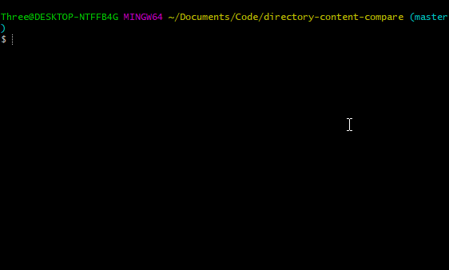

# [Python] Directory Comparison
## Objective:
Compares the content from one directory to another.

# Requirements:
- Have Python 3 installed on local machine
- Have Main.py downloaded from this git

# How to run: (Easy!)
1. Open bash/terminal/cmd
2. Go to directory of this folder
3. Type in >python main.py
4. Follow the prompts with the first and second directory

*Note: Folder 01 and Folder 02 contain a few very small files for the purpose of debugging. They aren't required for running the script.

# To complete in the future:
*As of 06/07/2018, it only compares differences relatively to the directory with the most content. 
Ideally, it should compare both directories to each other and list which directory is missing what from the other.

**This idea started when copying my music files to my OnePlus 5 phone and it keeps crashing whenever I paste in the same content.. So I use this to find out what is the difference so I can just copy and paste them instead of it crashing again.
